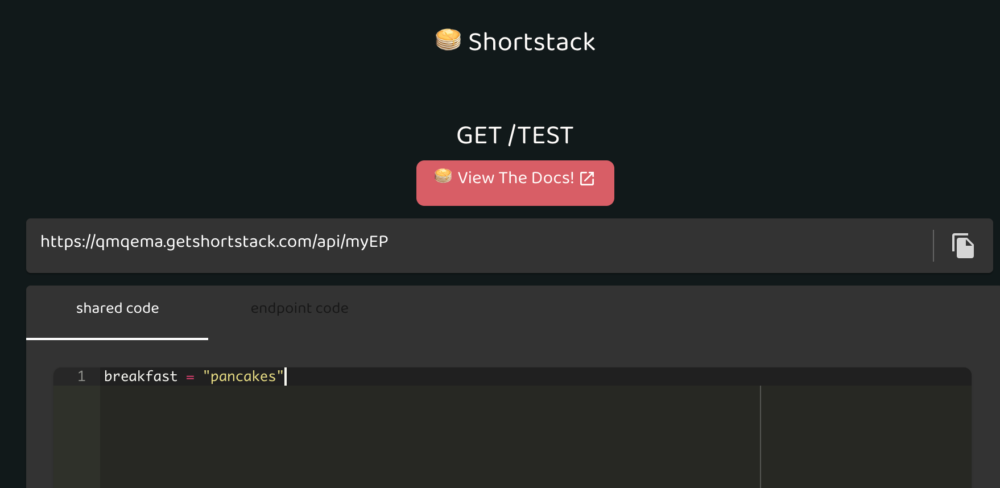
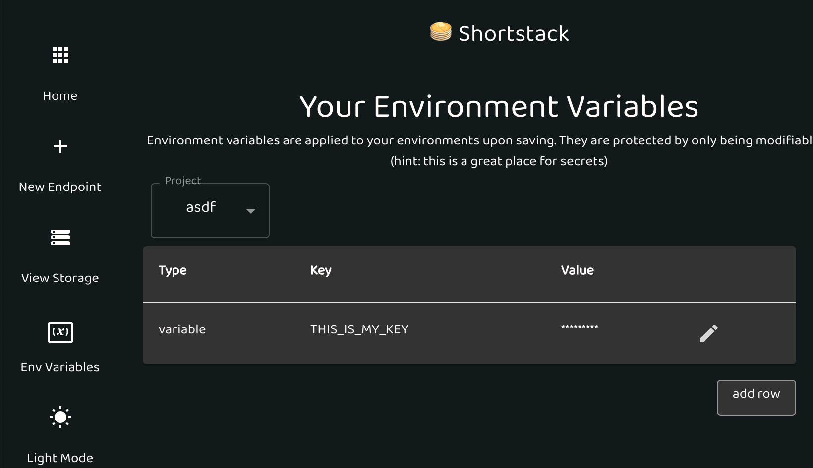
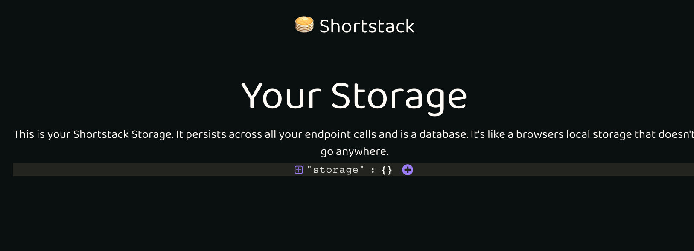
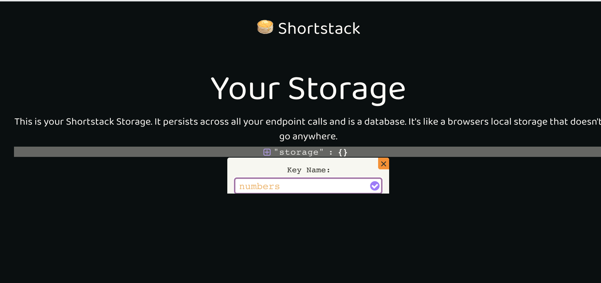
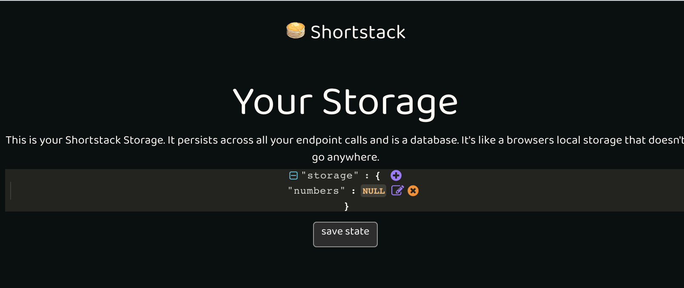
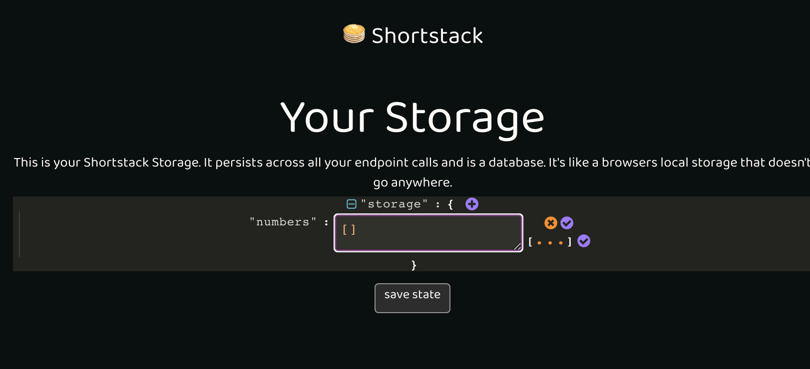

# Getting Started Guide

Use this quickstart guide to jump into Shortstack. If you have any lingering questions, [please e-mail us](nader+docs@getshortstack.com)

# Shortstack Endpoints

From a high level, Shortstack lets you create projects. In each project, you'll find:

- Endpoints: code executable by hitting a URL
- Shared Code: project level code that can be accessed by any endpoint in a project
- Variables: a secure way to use secrets and environment variables in your code.
- Storage: a simple dictionary that persists across your endpoints. It's a great way to build a proof of concept without needing to hook up a database.

## The Endpoints

- Endpoints are immediately accessible by a URL, which gets assigned once the endpoint is initially saved.
- When the URL is hit, the endpoint will pattern match the function name to the HTTP request type. For example, if we have an endpoint with the following code:

```python

# /myEndpoint

def GET():
  return {"hello":"GET"}

def POST():
  return {"hello": "POST"}
```

Calling GET /myEndpoint will return `{"hello": "GET"}`

And calling POST /myEndpoint will return `{"hello": "POST"}`

We currently support any of the following HTTP request types:

- GET
- PUT
- POST
- DELETE
- OPTIONS
- HEADs
- PATCH
- TRACE

## params

Now that you can create an endpoint on Shortstack, let's add parameters!

### Query Params

Simply add the parameter to the function and use it like a variable!

```python
def GET(name):
  return {"hello":name}
```

Now let's call endpoint `/myEndpoint?name=Shortstack`, and we'll get the following response:

```json
{
  "hello": "Shortstack"
}
```

### Path params

Just like the query params, just add the path parameter to the function

```python
def get(name):
  return {"hello":name}
```

Now let's call endpoint `/myEndpoint/Shortstack`, and we'll get the following response:

```json
{
  "hello": "Shortstack"
}
```

### JSON params

For a JSON body, you can create a Class and pass in an instance. The instance will be created with the contents of your JSON body!

```python
from pydantic import BaseModel # don't forget the import

# The class for the json body to be matched
class NewUser(BaseModel):
  name: str
  email: str
  phone: Optional[str] = None

# add the class as a parameter. Yay types! (it let's us know how to match the JSON) :)
def post(newUser: NewUser):
  return {
    "created": True,
    "newUser": newUser.name,
  }
```

So now if we call this endpoint with the following JSON body:

```json
POST /myEndpoint
{
  "name": "Shortstack",
  "email": "nader+hello@getshortstack.com",
  "phone": "123-456-7890"
}
```

We'll get the following response:

```json
{
  "created": True,
  "newUser": Shortstack
}
```

### File params

If you want to upload a file such as an image or document

```python
def post(file = File(...))

  # We're using our built in file uploader
  # see below for documentation on it
  link = upload_blob(file)

  return {"uploaded": True, "fileName": file.filename, "fileURL": link}
```

So let's upload this picture of our puppy 

POST /myEndpoint

```json
{
file: (the file)
}
```

The endpoint will respond with

```json
{
  "uploaded": True,
  "fileName": Toulouse.JPG,
  "fileURL": LINK_TO_TOULOUSE
}
```

Since this was a file upload, we could just add the file directly
as a function paremter `def post(file = File(...))`

### Another Example: File upload + json body

However, if we want to send more data in a json body, we can include the
File as an attribute of the JSON body class, as we saw with the json body example above. So let's do that!

```python
from pydantic import BaseModel # don't forget the import

# The class for the json body to be matched
class AwesomePhoto (BaseModel):
  createDate: str
  photo: File

# Your Endpoint function with the class as a parameter
def post(newPhoto: AwesomePhoto):
  link = upload_blob(newPhoto.photo)

  return {
  "uploaded": True,
  "fileName": newPhoto.photo,
  "fileURL": link
  }
```

So now if we call this endpoint with the following JSON body:

```json
POST /myEndpoint
{
  "createDate": "1970-01-01",
  "photo": (the file),
}
```

We'll get the following response:

```json
{
  "uploaded": True,
  "fileName": Toulouse.JPG,
  "fileURL": LINK_TO_TOULOUSE
}
```

## Shared Code

You'll notice each endpoint has two tabs. The `main` endpoint is under _*Endpoint Code*_. _Shared Code_ belongs to the project level, and can be accessed by any endpoint under that project.



You can access the shared code via the `shared` object in any endpoint. So the following will return pancakes

```python
shared.breakfast # will return "pancakes"
```

## variables

- `variables` is the Shortstack secret/environment variables manager. You can access it [here](https://app.getshortstack.com/variables)

  1. Add any environment variable or secret on the Variables page. Note: these variables are protected per project.
     

  2. You can use any of your variables by the `variables` object in your endpoint code.
     For example:

  ```python
    variables.THIS_IS_MY_KEY
  ```

## storage

- `storage` is a dictionary for you to persist data. It's a bootstrapped database inspired by localStorage. It's available across all of your endpoints. Go to [Your Storage](https://app.getshortstack.com/storage) to initialize or edit objects. For example, let's create a new list to store phone numbers:

  1. Hover your cursor over storage and click on the '+' icon that appears
     
  2. Name this list. We'll call it numbers
     
  3. Note the data type defaults to NULL. Hover your cursor over NULL and click on the edit(pencil) that appears
     
  4. Replace null with empty brackets for a list and click the purple check on the right. Make sure the click the check next to [ ... ] to save the data type as a list instead of string
     

  Yay! Your storage now has a list called numbers ready to use :)
  In an endpoint, the following code would add phone numbers to the list!

  ```python
  # /endpoint?number=415555555
  state["numbers"].append(params.get("number"))
  ```

## Endpoint Responses

Every endpoint ends with the following code block:

```python
  # your endpoint response
  response_body = {}
  status_code = 200
  return response_body, status_code
```

- `response_body` is a [python dictionary](https://docs.python.org/3/tutorial/datastructures.html#dictionaries) that your endpoint returns as JSON. You can put anything here to return it.
- `status_code` is the HTTP status code to return. 2XX is success, 3XX is redirection, 4XX is client error, and 5XX is server error. [read more on status codes here](https://www.restapitutorial.com/httpstatuscodes.html)
- `request` is a [flask request object](https://kite.com/python/docs/flask.Request).

# Shortstack Out-of-the-Box

Shortstack comes with many services out-of-the-box! Rather than waste time making accounts, managing multiple bills, configuring services, etc, you can just code :)

## SMS

- `sms(number: string, message: string)` is a simple way to send SMS messages. It comes from a real 10-digit number (not a short code). 2way texting support coming soon!

  ```python
  # Example:
  sms("415555555", "hello from shortstack!")

  ```

  Or try it with a query parameter!

  ```python
  def main(params, state, request):
      # /endpoint?number=415555555
      sms(params.get("number"), "hello from shortstack!")

      # your endpoint response
      response_body = {sent: True} #confirm that you sent the text
      status_code = 200
      return response_body, status_code
  ```

## Upload Files

- `upload_blob(blob)` is a file uploader. Call this function with the blob and it will return a URL to access it. You can store this URL in state or simply return it from the endpoint.

```python
# POST /endpoint

def main(params, state, request):
    # your code here
    file = request.files[“file”] # process the file from the request
    file_bytes = file.read()
    link = upload_blob(file_bytes) # call the Shortstack upload_blob function which returns a url
    # your endpoint response
    response_body = {“link”: link}
    status_code = 200
    return response_body, status_code
```

# Shortstack CLI

If you have a development environment you like, you might prefer to
develop there rather than go configure a new one in the browser. We get that! The Shortstack CLI will allow you to do everything the web app lets you do

- create/delete endpoints
- run them in the remote environment
- view logs
- add packages
- anything\* else you can do in the web app :)

\* almost anything

## Installation

Probably something like

Mac OS:

```zsh
$ brew install stack-cli
```

Windows:

```zsh
$ npm install stack-cli
```

## Getting Started

Now that you have the CLI installed, you'll need to initialize to your stack account.

### Authenticate:

First authenticate yourself

```zsh
stack init
```

### Initialize

Once authenticated, you'll need to initialize

```zsh
stack initialize
```

This will create a local directory at ~/GetShortstack with a folder per projecct. In each project folder, you'll find the endpoints, your shared code, and variables as individual .py files.

### Set Environment

Similar to the project dropdown from the web app, you'll need to specify which project you're working with. This allows you to add packages, variables/secrets, and endpoints; respecting each project's isolated runtime.

```zsh
stack set ProjectName
```

You can view active environment settings with the `status` command:

```zsh
stack status
```

NOTE: We highly recommend setting up Zsh & autocomplete. It'll let you tab through commands like butter

## Creating

### Add or Remove

- `Packages`: You can add any package installable by Pip
  ex: to install numpy

```zsh
stack add package numpy
stack remove package numpy
```

- `Endpoints`: You can create new endpoints in the active project

```zsh
stack add endpoint MyEndpointName
stack remove endpoint MyEndpointName
```

- `Variables`: You can add variables/secrets from [the app](https://app.getshortstack.com/variables) or right from the command line

```zsh
stack add variable NewVar
stack remove variable NewVar
```

Then follow the prompt for the variable value. Note: while you can update the value at any time, we never reveal the value for your security.

### Create New Project

You can create a new project with

```zsh
stack new project MyNewProject
```

Note: this does not set it as the active project. You'll need to use `stack set` for that:

```zsh
stack set project MyNewProject
```

## Running

### List

You can use the `list` command to list available projects, packages, and endpoints. See below

View available projects:

```zsh
stack list project
```

View packages added to the environment. You can `remove` them or `add` new ones.

```zsh
stack list package
```

View endpoints and their associated URLs. You can execute them with `run`.

```zsh
stack list endpoint
```

### Run

You can execute any endpoint right from the terminal.

```zsh
stack run MyEndpoint [GET, POST, PUT, DELETE] --args --body *.json
```

The third argument is the HTTP request type.
Add query args with --args, or -a
Add any json file in the request body with --body or -b

To make a GET request:

```zsh
stack run MyEndpoint GET --a  message=Hello
```

Makes a GET call to `/MyEndpoint?message=Hello`

To make a POST request:

```zsh
stack run MyEndpoint POST --b  body.json
```

Makes a POST call to `/MyEndpoint` with the body.json

### Logs

After running an endpoint, Shortstack automatically collects logs and standard out! View them by running the `logs` command:
To view all the logs of a project, run:

```zsh
stack logs
```

You can also view the logs of an individual endpoint

```zsh
stack logs endpoint MyEndpoint
```

## Syncronizing

Now that you've made changes locally, it's time to save them so they're syncronized with Shortstack & the web app.

### Diff

To view a difference of what's syncronized with remote, run `diff`:

```zsh
stack diff
```

### Override

Use `override` to sync the changes.

To override your local changes with those saved to your Shortstack account, override your local:

```zsh
stack override local
```

To override your remote changes with those saved to your local environment, override your remote:

```zsh
stack override remote
```

Note: override only syncronizes your active project. You can set the active project with `set`

# [Release Notes](/release.md)

```

```
