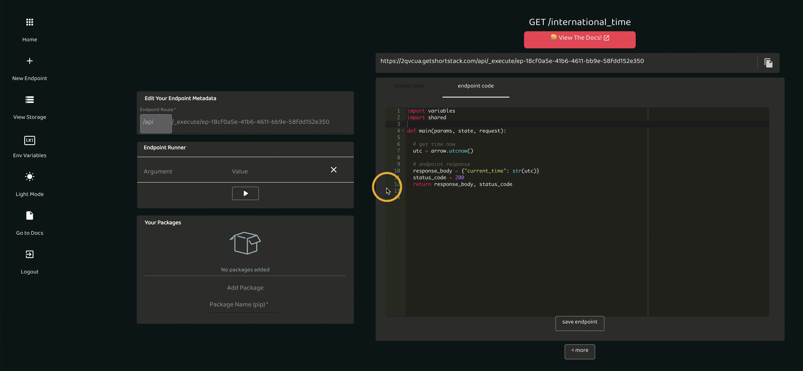

# v0.3

_released july 30 2020_

## Shared Code

  
You'll notice your code editor now has tabs. Any code you write in the shared code tab is accessible by every endpoint! This code is shared on the project level.

## Environment Variables

  
Store your project's Environment Variables/Secrets in the Variables manager to securely use these values in your code! Use Variables from the left, and the "variables" object in your code.

## Rename Your Endpoints

  
You can now rename your endpoints! You could also leave the UUID if that's your thing :)

## 3rd Party Packages

  
We're really excited about this one. You can now use 3rd party packages through the Package Manager! The Package Manager is right below the Endpoint Runner on every endpoint page. Packages install per project.

# v0.2

_released july 11 2020_

---

## Projects

You can now group your endpoints by project! All of your existing endpoints will be in the "default" project. Use the project switcher (see image below) to navigate between projects or create new ones.

## Fresh Coat of Paint

You'll also notice a simpler UI, with the endpoint runner that can be toggled away. Copying the endpoint now also copies your query arguments if any! Dark mode & light mode got a lift :)
